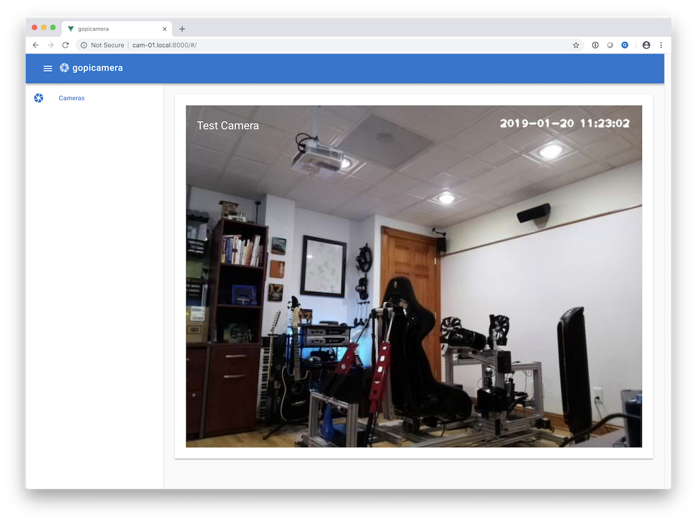

# gopicamera

RaspberryPi camera streamer with VueJS frontend and automatic discovery of all the other cameras running on the local network.  



gopicamera is a work in progress, but it will eventually include authentication and wifi configuration from the web interface. The end goal is to roll an SD card image for the Raspberry Pi Zero W that can get you booted in to a functional gopicamera instance as quickly as possible.

I started this project because I want to be able to aggregate many camera sources into a single backend service that can do various object/state detection on all the incoming streams at the same time. 
One of the first models I will be training is the detection of failed 3d prints (ie. spaghetti mess), when the system detects a failed print it can notify you... hopefully saving you from an even bigger mess.

## Supporting packages

A precompiled package for OpenCV4 can be found in [packages](/packages/), please also install all of the other dependancies listed.


## Using gopicamera
**NOTE: This will change once I roll a custom SD card image.**


### Initial setup

Purcase yourself a Raspberry Pi Zero W (https://www.adafruit.com/product/3400), power supply, and Camera (https://www.amazon.com/dp/B07JKZFJXD).

Download Raspbian Stretch Lite from https://www.raspberrypi.org/downloads/raspbian/ and then burn to an SD card (4GB or larger) using Etcher (https://www.balena.io/etcher/). 

Re-insert the SD card in to your computer and create a blank text file called `ssh` in the **boot** volume.  Create another file called `wpa_supplicant.conf` and paste the following (adjusting to your own SSID and passphrase):
```
ctrl_interface=DIR=/var/run/wpa_supplicant GROUP=netdev
update_config=1
country=US

network={
    ssid="WIFI_SSID"
    scan_ssid=1
    psk="WIFI_PASSWORD"
    key_mgmt=WPA-PSK
}
```
place `wpa_supplicant.conf` in the **boot** volume also. Unmount the SD card and place it in the Pi Zero then apply power.  Wait a little while to allow the pi to boot and show up on your network.


### Configuring the pi

If you are on a mac or linux system (running avahi) you can ssh to the pi by running `ssh pi@raspberrypi.local`, the initial password is 'raspberry'.  Please change the password immediately by typing the `passwd` command and following the prompts.

Update Raspbian by running `sudo apt-get update && sudo apt-get upgrade`.  Once updated you can proceed to installing the supporting packages.
```
sudo apt-get install --yes libtesseract3 ffmpeg libjasper1 libhdf5-100 liblapack3 libatlas3-base libgtk-3-bin
```

Download and install the precompiled version of OpenCV4 `wget https://github.com/dchote/gopicamera/raw/master/packages/opencv4_4.0.1-1_armhf.deb` and then `sudo dpkg -i opencv4_4.0.1-1_armhf.deb`.  This is a little verbose at the moment, I hope to cleanup the output later.

**Enable the camera** by running `sudo raspi-config`, use the cursor keys to navigate to **Interfacing Options** and then **P1 Camera**, enable the camera.  Press escape to exit to the main menu and then select **Finish**, this will prompt you to reboot, do so.


### Running gopicamera

Download the latest release from the project releases page https://github.com/dchote/gopicamera/releases, from the latest release right click **gopicamera.zip** and copy link, download it to your pi by running `wget *PASTE_LINK_HERE*`. Unzip the files `unzip gopicamera.zip`.

Make **gopigocamera** executable `chmod a+x gopigocamera`, ensure the bcm2835-v4l2 kernel module is loaded `sudo modprobe bcm2835-v4l2`, and edit **config.json** to suite your needs. 

Run gopicamera as root `sudo ./gopicamera` it will then tell you the address that you can copy and paste in to your browser to view the camera (example: *starting server on http://172.18.0.117:8000*).

